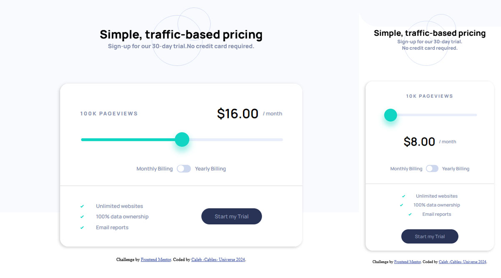

# Frontend Mentor - Interactive pricing component solution

This is a solution to the [Interactive pricing component challenge on Frontend Mentor](https://www.frontendmentor.io/challenges/interactive-pricing-component-t0m8PIyY8). Frontend Mentor challenges help you improve your coding skills by building realistic projects. 

## Table of contents

- [Overview](#overview)
  - [The challenge](#the-challenge)
  - [Screenshot](#screenshot)
- [My process](#my-process)
  - [Built with](#built-with)
  - [What I learned](#what-i-learned)
- [Author](#author)

## Overview

### The challenge

Users should be able to:

- View the optimal layout for the site depending on their device's screen size
- See hover states for all interactive elements on the page
- See pageviews and price to raise with the range slider
- Monthly/yearly billing effects the price

### Screenshot

## My process

### Built with

- Semantic HTML5 markup
- SCSS custom properties
- Flexbox
- Mobile-first workflow
- JavaScript

### What I learned

Throughout this project I was reminded how each browser handles some elements differently. Particularly the input type='range'. 

Firefox (my main browser) handles range sliders easily, with simple tags to access the track or thumb.

Chrome either does not allow for a developer to manipulate the range slider as thoroughly, or their documentation does not mention it. 

Also adding an icon to display overtop of a range thumb is obtuse, unless  the range slider is built from scratch with JS. 

## Author

- Website - [Caleb - Cables - Universe](https://cables97.github.io/)
- Frontend Mentor - [@cables97](https://www.frontendmentor.io/profile/Cables97)

